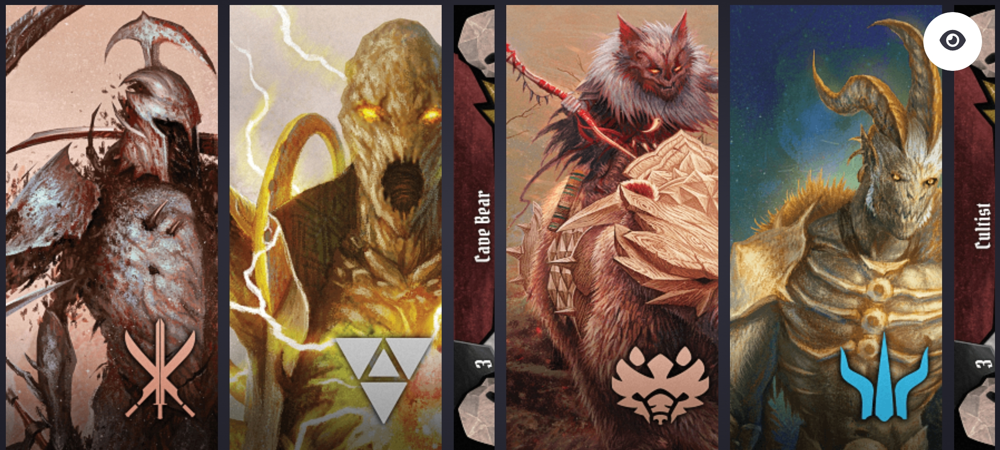

# GLOOMHAVEN Companion (WIP)


Little companion to manage gloomhaven turn order in a simple manner.

**Why not using an existing app?**

You can use them of course, but this app is designed to lay down on the game board.  


## :link: Access Site

This app is currently not deployed, but will be available at companion.gloomhaven.tomschinelli.io

**Note:** To save money, the app must be deployed manually and will be 
destroyed every evening at 24:00 UTC. Since it is mainly for my own group, it will only be deployed, when we're playing

If there is enough interest in this app, me


## Developer Guide

The application is designed to run on a mobile device in landscape mode.
Therefore, when running the code locally (directly with node, or docker), enter
the ip of your device, where the code is running instead of localhost.
 

You can run the application with one of the possibilities below:

### Setup 

Requirements: 
- nodejs (tested with v20.2.0)

Run dev server
```shell
npm intall
npm run dev
# > gloomhaven-companion@0.0.1 dev
# > vite dev --host
# 
# 
# 
#   VITE v4.3.9  ready in 484 ms
# 
#   ➜  Local:   http://localhost:5173/
#   ➜  Network: http://(your ip):5173/
#   ➜  press h to show help
```

A good starting point to inspect the code is the file `src/routes/+page.svelte`

### Run Container
Run 
```shell
docker pull ghcr.io/tomschinelli/gloomhaven-companion:latest
docker run -p 8080:3000 --init ghcr.io/tomschinelli/gloomhaven-companion:latest
# Listening on 0.0.0.0:3000
```

Open the browser at http://localhost:8080

### Build Container locally
Run 
```shell
docker build --tag gloomhaven-compantion .
docker run -p "8080:3000" --init gloomhaven-compantion
# Listening on 0.0.0.0:3000
```

## :bulb: Ideas for the future

All features depend on my personal need or if there is enough interest in this app. 

So all features mentioned below are currently just ideas:

### Modular design
Each feature can be displayed on its own device. 

This way, you can opt in features for your personal need. 

**Pitfalls:** 

This feature requires a backend that currently doesn't exist. 

All devices have to communicate with each other. If the deployed version is used by 
multiple groups, this must be considered in the backend.

Furthermore, users must log into the app.

This escalates quickly into much work.


## :clap: Thanks

Props to https://github.com/any2cards/gloomhaven  for providing tons of assets